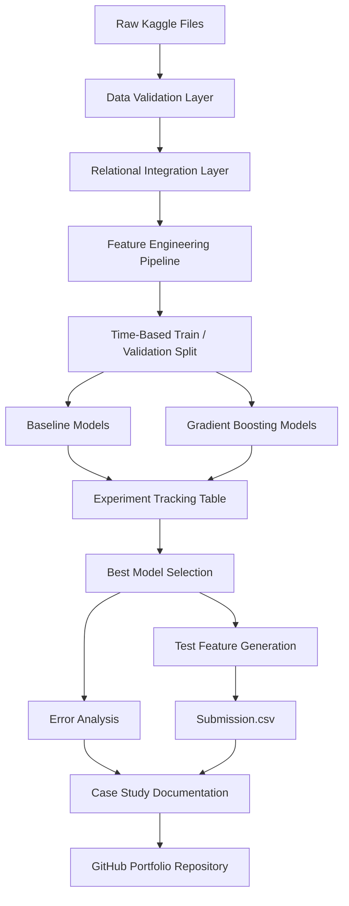
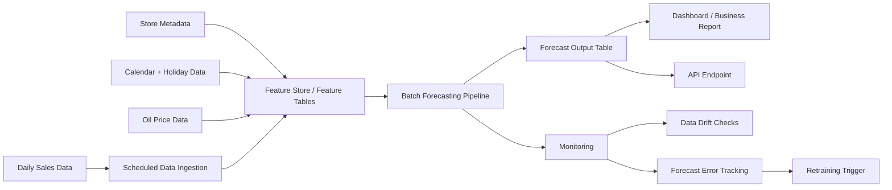
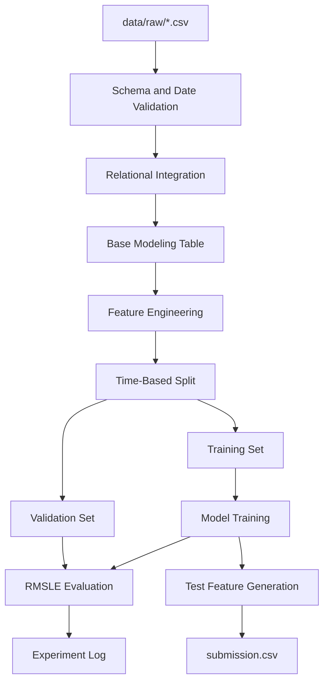

# Architecture

This document describes the intended architecture for the Store Sales forecasting project. It covers the notebook prototype, modular pipeline design, validation design, inference flow, deployment path, monitoring plan, and limitations.

## System Architecture Overview

## Production-Minded Architecture

## Layered Design

### Data Layer

Responsibilities:

- Load raw CSV files
- Parse date columns
- Validate expected columns and key uniqueness
- Keep raw data immutable
- Document missing values and date ranges

### Integration Layer

Responsibilities:

- Join train and test rows with store metadata
- Join oil prices by date after missing-value strategy is defined
- Aggregate holiday rows before joining to prevent row duplication
- Decide whether transactions are EDA-only or model-safe
- Produce modeling-ready base tables

### Feature Layer

Responsibilities:

- Create deterministic calendar features
- Create holiday flags and grouped event features
- Create oil lags and rolling averages if useful
- Create store-family lag and rolling target features
- Create Fourier features for weekly and annual seasonality
- Ensure feature logic is shared between train, validation, and test
- Include leakage checks and required-column assertions

### Validation Layer

Responsibilities:

- Create date-based holdout split
- Optionally create expanding-window or sliding-window splits
- Confirm validation dates always follow training dates
- Track validation period for every experiment
- Use RMSLE with non-negative predictions

### Modeling Layer

Responsibilities:

- Train naive and moving-average baselines
- Train linear or Ridge baseline
- Train gradient boosting models
- Handle categorical variables consistently
- Save model settings and experiment notes
- Compare validation results with model complexity

### Evaluation Layer

Responsibilities:

- Compute RMSLE
- Compare actual vs predicted values
- Analyze residuals over time, store, family, holiday periods, and zero-sales groups
- Plot feature importance
- Compare validation and leaderboard behavior

### Documentation Layer

Responsibilities:

- Turn technical work into a public case study
- Explain decisions, tradeoffs, risks, and limitations
- Record experiment results
- Describe deployment and monitoring path

## Data Flow

## Inference Architecture

The final prediction process should use the same feature definitions used during validation:

1. Load test rows.
2. Append or reference historical training sales where needed for lag and rolling features.
3. Build deterministic calendar, holiday, store, oil, lag, rolling, and Fourier features.
4. Align feature columns to the final model's expected schema.
5. Predict sales.
6. Clip predictions at zero.
7. Save predictions in Kaggle submission format.

## Monitoring Plan

Production monitoring would track:

- Missing input files or columns
- Unexpected date gaps
- Changes in store-family coverage
- Oil price missingness and range shifts
- Holiday table changes or duplicate-join risk
- Prediction distribution drift
- Forecast error by store, family, and date once actuals arrive
- RMSLE degradation over rolling windows

## Known Limitations

- Kaggle test targets are unavailable during competition evaluation, so true test error must be inferred from leaderboard feedback.
- Public leaderboard can encourage overfitting if validation is weak.
- Transactions may not be available for future dates, limiting their use as a production feature.
- Holiday effects can be sparse and difficult to learn globally.
- Zero-sales rows may require business logic beyond standard regression models.
- Deep learning models may add complexity without improving tabular forecasting performance.

