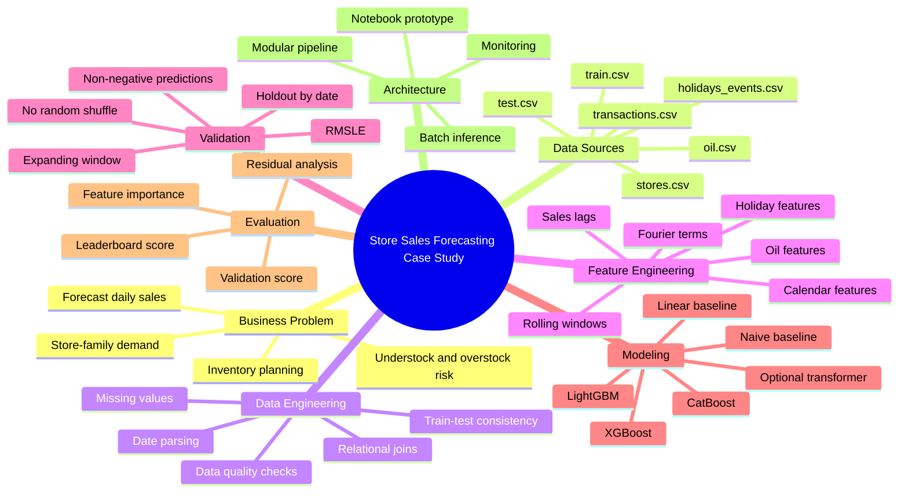

# Project Planning

## Problem Framing

Forecast daily sales for each store and product-family combination in the Kaggle Store Sales competition. The project should demonstrate practical forecasting skill, not just competition participation.

The finished work should prove:

- Ability to translate a business forecasting problem into an ML system
- Comfort with relational data integration
- Discipline around leakage-safe feature engineering
- Understanding of time-series validation
- Ability to compare baselines with advanced models
- Ability to explain model errors and business implications
- Ability to document a project clearly for GitHub review

## Public Positioning

| Item | Positioning |
|---|---|
| Title | Store Sales Forecasting - End-to-End Time Series Forecasting Case Study |
| Portfolio angle | Forecasting retail demand using relational data, leakage-safe features, and production-minded ML architecture |
| Audience | Recruiters, ML engineers, data scientists, and technical reviewers |
| Main proof of skill | Data integration, validation design, feature engineering, model comparison, error analysis, documentation |

## Dataset Map

## Assumptions

- Kaggle data will be downloaded manually into `data/raw/`.
- Raw data may not be committed to GitHub.
- The final target metric is RMSLE.
- Predictions must be clipped at zero before evaluation and submission.
- Calendar and holiday features are known in advance.
- Transactions will be used mainly for EDA unless a future-safe modeling strategy is defined.
- The initial deliverable is a strong gradient boosting solution; deep learning is optional and secondary.

## Phase Roadmap

| Phase | Objective | Deliverable | Status |
|---|---|---|---|
| 0 | Setup and project structure | Repo scaffold, docs, success criteria | Drafted |
| 1 | Data integration and EDA | EDA notebook, data dictionary, observations | Not started |
| 2 | Feature engineering | Reusable leakage-safe feature pipeline | Not started |
| 3 | Model selection and validation | Baselines, boosting models, experiment log | Not started |
| 4 | Error analysis and refinement | Residual plots, feature importance, refinements | Not started |
| 5 | Submission and documentation | Submission file, polished case study | Not started |
| Bonus | Attention/transformer experiment | Controlled comparison section | Not started |

## Detailed Backlog

### Documentation

- [x] Draft README before coding starts
- [x] Add public mind map
- [x] Add repository folder tree
- [x] Add dataset explanation
- [x] Add architecture diagrams
- [x] Add first version of case study
- [ ] Update case study after EDA
- [ ] Update case study after feature engineering
- [ ] Update case study after modeling
- [ ] Add final results and lessons learned

### Engineering

- [x] Create repository structure
- [ ] Create configuration file
- [ ] Create data loading utilities
- [ ] Create feature modules
- [ ] Create validation utilities
- [ ] Create metric utilities
- [ ] Create modeling utilities
- [ ] Create plotting utilities
- [ ] Create submission generation workflow

### Analysis

- [ ] Analyze global sales trend
- [ ] Analyze store-level sales
- [ ] Analyze family-level sales
- [ ] Analyze day-of-week seasonality
- [ ] Analyze month-level seasonality
- [ ] Analyze holidays
- [ ] Analyze earthquake period
- [ ] Analyze oil price gaps
- [ ] Analyze zero-sales combinations

### Modeling

- [ ] Naive baseline
- [ ] Moving-average baseline
- [ ] Linear or Ridge baseline
- [ ] LightGBM first model
- [ ] XGBoost or CatBoost comparison
- [ ] Hyperparameter tuning
- [ ] Feature ablation
- [ ] Final model selection
- [ ] Submission generation

## Risk Register

| Risk | Why It Matters | Mitigation |
|---|---|---|
| Data leakage from lag or rolling features | Can create unrealistic validation scores | Shift target before rolling and manually inspect rows |
| Random validation split | Invalid for time-series forecasting | Use date-based holdout and optional expanding-window validation |
| Transactions unavailable for future dates | May not be usable as production input | Use transactions mainly for EDA unless future-safe logic is defined |
| Holiday merge duplication | Multiple holiday rows can duplicate sales rows | Aggregate holiday features before merging |
| Oil price missing values | Missing economic signal can add noise | Use documented imputation and compare feature impact |
| High memory usage | Lag and rolling features can create large tables | Use selective features and efficient dtypes during implementation |
| Leaderboard overfitting | Public score may encourage poor generalization | Trust validation design and keep experiment notes |

## Final GitHub Checklist

- [ ] Repository name is clear and professional
- [ ] README explains the project in less than two minutes
- [ ] Case study explains the project in depth
- [ ] Architecture file shows system-level thinking
- [ ] Planning file shows structured execution
- [ ] Notebook is clean and readable
- [ ] Code is modular enough to inspect
- [ ] Plots are saved and referenced in documentation
- [ ] Results table is included
- [ ] Limitations are honest
- [ ] Future work is realistic
- [ ] No large raw data files are accidentally committed
- [ ] No Kaggle credentials or secrets are committed

