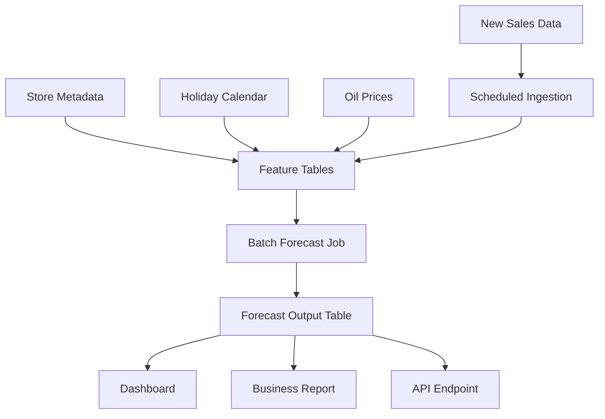

# Deployment Plan

This document describes how the Kaggle notebook could evolve into a production-style forecasting system.

## Goal

Generate daily or weekly forecasts for store-family sales and deliver them to business users through tables, dashboards, reports, or an API.

## Batch Forecasting Workflow

## Proposed Components

| Component | Role |
|---|---|
| Data ingestion | Load new sales, promotions, oil, holidays, and metadata |
| Data validation | Check schemas, date gaps, duplicate keys, and missing values |
| Feature generation | Build calendar, holiday, lag, rolling, oil, and store features |
| Model inference | Generate forecasts for the target horizon |
| Forecast storage | Save predictions with date, store, family, model version, and run ID |
| Dashboard/report | Present forecasts, trends, and uncertainty notes |
| Monitoring | Track input drift, output drift, and realized forecast error |
| Retraining | Refresh model on schedule or when performance degrades |

## Possible Technology Stack

| Layer | Possible Tools |
|---|---|
| Language | Python |
| Data processing | pandas, Polars, DuckDB, or Spark depending on scale |
| Modeling | LightGBM, XGBoost, CatBoost |
| Scheduling | cron, Airflow, Prefect, Dagster, or cloud scheduler |
| Storage | Cloud object storage, database tables, or warehouse |
| API | FastAPI |
| Dashboard | Power BI, Tableau, Streamlit, Dash, or internal BI |
| Monitoring | Custom reports, Evidently, WhyLabs, or warehouse checks |

## Retraining Strategy

Recommended cadence:

- Start with monthly retraining.
- Retrain earlier if forecast error rises above a threshold.
- Re-evaluate after major holiday seasons or promotion changes.

Track each model version:

- Training date range
- Validation date range
- Feature set
- Model family and hyperparameters
- Validation RMSLE
- Production error after actuals arrive

## Monitoring

Monitor inputs:

- Missing required columns
- Date gaps
- New stores or product families
- Oil price missingness
- Holiday table changes
- Promotion distribution shifts

Monitor forecasts:

- Prediction distribution by store and family
- Number of zero or near-zero predictions
- Sudden forecast spikes
- Forecast totals vs recent history
- Error by store, family, and date once actuals arrive

## Business Delivery

Forecast outputs should support:

- Inventory planning
- Store replenishment decisions
- Product-family demand review
- Holiday readiness
- Exception reporting for unusual spikes or drops

## Limitations

- Forecast quality depends on the availability and quality of future-known features.
- Transaction counts may require a separate forecasting model if used in production.
- Extreme events may not be predictable from historical patterns.
- Store openings, closures, or assortment changes require additional metadata.

